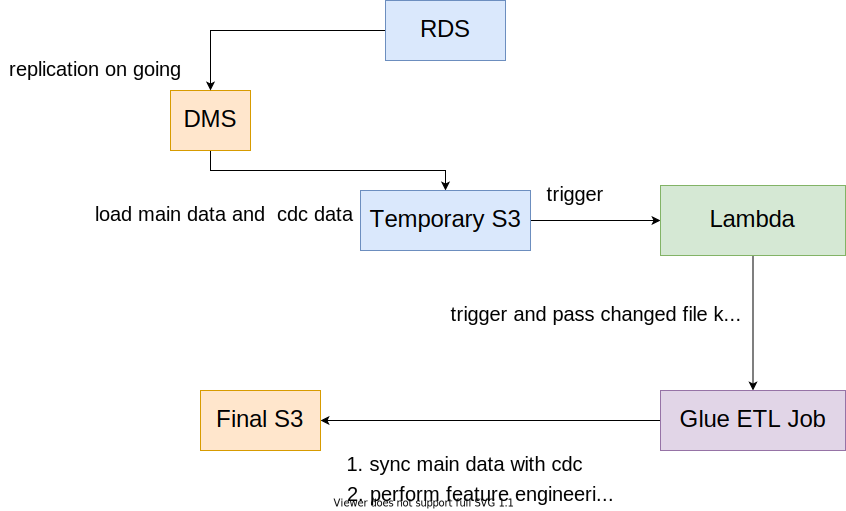

## About

An exmaple of using pyspark and aws for change data capture (CDC) and feature engineering.

Suppose we have in a transactional databse some imaginary user data:

```
+-------+----------------+-------------+----------+
|user_id|name            |city         |last_login|
+-------+----------------+-------------+----------+
|0      |Herman Zimmerman|Oklahoma city|2020-10-10|
|1      |Lisa Ray        |Columbus     |2021-04-01|
|2      |Terrell Reeves  |Jacksonville |2017-01-01|
|3      |Steve Goodwin   |Charlotte    |2021-09-19|
|4      |Leah Tran       |Detroit      |2021-04-05|
|5      |Wilbert Holmes  |Washington   |2021-07-23|
|6      |Mindy George    |Los Angeles  |2021-10-01|
|7      |Rosa Huff       |Phoenix      |2021-10-17|
|8      |Lebron James    |Denver       |2021-10-17|
|9      |Darla Hayes     |Nashville    |2021-10-15|
+-------+----------------+-------------+----------+
```

We would like to move this data to another endpoint for analytical tasks, e.g, a data warehouse. Since this table gets constantly updated, we nend to sync the data to keep in line with the transactional databse. Each time there is a insert, update or delete operation happened in the transactional database, we will generate some records to capture the changes using a another cdc table that looks like

```
+------+-------+------------+-----------+----------+
|action|user_id|name        |city       |last_login|
+------+-------+------------+-----------+----------+
|U     |6      |Mindy George|Los Angeles|2021-10-15|
|I     |133    |Bob Ding    |New York   |2021-10-17|
|I     |134    |Ross Green  |Seattle    |2021-10-17|
|I     |135    |Monica Bing |Portland   |2021-10-17|
|U     |8      |Kevin Durant|Denver     |2021-10-14|
+------+-------+------------+-----------+----------+
```

As the action column indicates what to do and the other four columns captures the changed data, we now can update the table with cdc records.

## The Flow



Whenever the transactional dabases (RDS) changes, DMS will issue a cdc table to a temporary s3 bucket, which then invoked a lambda function. The lambda function tells the upstream pyspark ETL job which file needs to be read and updated. After the synchronization, the ETL job also performs some feature engineering with the updated data, e.g., denormalization, customer ranking, regional summary, etc. The data (below) is saved to a final s3 bucket prepared for analytical tasks.

```
+-------+-----------------+---------+----------+--------------+-----------------------+--------------------------------+-------------+
|user_id|name             |city     |last_login|state         |last_login_rank_by_city|login_rate_last_3_months_by_city|users_by_city|
+-------+-----------------+---------+----------+--------------+-----------------------+--------------------------------+-------------+
|73     |Oliver Figueroa  |Austin   |2019-10-03|Minnesota     |3                      |0.3333333333333333              |3            |
|81     |Samantha Myers   |Austin   |2021-01-01|Minnesota     |2                      |0.3333333333333333              |3            |
|11     |Francis Davidson |Austin   |2021-09-20|Minnesota     |1                      |0.3333333333333333              |3            |
|75     |Malcolm Nelson   |Boston   |2021-07-15|Massachusetts |3                      |0.6666666666666666              |3            |
|36     |Josephine Sherman|Boston   |2021-08-14|Massachusetts |2                      |0.6666666666666666              |3            |
|69     |Maurice Chandler |Boston   |2021-09-25|Massachusetts |1                      |0.6666666666666666              |3            |
|20     |Domingo Byrd     |Charlotte|2021-09-10|North Carolina|2                      |1.0                             |2            |
|3      |Steve Goodwin    |Charlotte|2021-09-19|North Carolina|1                      |1.0                             |2            |
|93     |Kate Mcbride     |Chicago  |2021-08-13|Illinois      |2                      |1.0                             |2            |
|17     |Martin Adkins    |Chicago  |2021-09-03|Illinois      |1                      |1.0                             |2            |
+-------+-----------------+---------+----------+--------------+-----------------------+--------------------------------+-------------+
```
